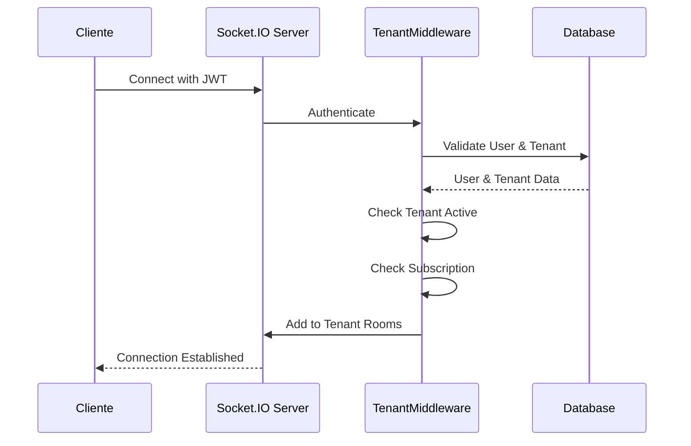

# Item 6: SocketIOIsolation

## 📋 Visão Geral

Implementação completa de isolamento multi-tenant para comunicações em tempo real via Socket.IO, garantindo que mensagens e eventos sejam transmitidos apenas dentro dos limites de cada tenant.

## ✅ Sistema Já Implementado

A análise revelou que o sistema Socket.IO já possui uma implementação robusta de multi-tenancy!

### Componentes Existentes:

1. **`middleware/socketTenantMiddleware.js`**
   - Autenticação JWT na conexão
   - Resolução automática de tenant
   - Validação de acesso cross-tenant
   - Gestão de rooms por tenant
   - Helpers para broadcast isolado

2. **`socket/socketHandlers.js`**
   - Handlers com contexto de tenant
   - Validação em cada evento
   - Rooms isoladas por tenant e role
   - Prevenção de vazamento de dados

## 🔧 Arquitetura Implementada

### 1. Autenticação na Conexão

```javascript
// Cliente se conecta com token JWT
const socket = io(SERVER_URL, {
  auth: { 
    token: jwtToken,
    tenantKey: 'company-slug' // opcional
  }
});
```

O middleware valida:
- Token JWT válido
- Usuário existe e está ativo
- Tenant está ativo
- Assinatura não está suspensa

### 2. Estrutura de Rooms

Cada conexão é automaticamente adicionada às rooms apropriadas:

```
tenant:{tenantId}              - Room geral do tenant
tenant:{tenantId}:agents        - Apenas agentes do tenant
tenant:{tenantId}:clients       - Apenas clientes do tenant
conversation:{conversationId}   - Conversa específica
```

### 3. Fluxo de Autenticação



### 4. Isolamento de Eventos

Todos os eventos são validados para garantir isolamento:

```javascript
// Validação automática em cada evento
socket.on('send-message', async (data) => {
  // Verifica se o usuário tem acesso ao tenant
  if (socket.tenantId !== data.tenantId) {
    return socket.emit('error', 'Cross-tenant access denied');
  }
  
  // Processa apenas dentro do tenant
  const message = await processMessage({
    ...data,
    tenantId: socket.tenantId // Força o tenant do socket
  });
  
  // Emite apenas para o tenant
  io.to(`tenant:${socket.tenantId}`).emit('new-message', message);
});
```

## 🎯 Funcionalidades Principais

### 1. Resolução de Tenant

O middleware suporta múltiplas formas de identificar o tenant:

1. **Por usuário**: Tenant associado ao usuário no banco
2. **Por token**: TenantId incluído no JWT
3. **Por handshake**: TenantId ou slug enviado na conexão
4. **Fallback**: Tenant padrão se configurado

### 2. Broadcast por Tenant

Helpers disponíveis para envio isolado:

```javascript
// Enviar para todos do tenant
socketTenantMiddleware.emitToTenant(io, tenantId, 'event', data);

// Enviar apenas para agentes
socketTenantMiddleware.emitToTenantAgents(io, tenantId, 'event', data);

// Enviar apenas para clientes
socketTenantMiddleware.emitToTenantClients(io, tenantId, 'event', data);
```

### 3. Validação de Módulos

Verifica se o tenant tem acesso ao módulo:

```javascript
// Middleware para validar módulo
io.use(socketTenantMiddleware.requireModule('chat'));
```

### 4. Estatísticas por Tenant

```javascript
// Obter estatísticas de conexões
const stats = socketTenantMiddleware.getConnectionStats();
// {
//   "tenantId1": {
//     "totalConnections": 5,
//     "connections": [...]
//   },
//   "tenantId2": {
//     "totalConnections": 3,
//     "connections": [...]
//   }
// }
```

## 🔒 Segurança

### Prevenções Implementadas:

1. **Cross-tenant access**: Impossível enviar/receber eventos de outro tenant
2. **Token validation**: JWT validado em cada conexão
3. **Tenant suspension**: Conexões rejeitadas se tenant inativo
4. **Role-based rooms**: Separação entre agentes e clientes
5. **Event validation**: Cada evento valida contexto de tenant

### Códigos de Erro:

| Código | Descrição |
|--------|-----------|
| `Authentication required` | Token não fornecido |
| `Invalid token` | Token JWT inválido |
| `User not found` | Usuário do token não existe |
| `Tenant suspended` | Tenant está inativo |
| `Tenant not identified` | Não foi possível identificar tenant |
| `Cross-tenant access denied` | Tentativa de acesso a outro tenant |
| `Module not enabled` | Módulo não habilitado para o tenant |

## 📝 Uso no Frontend

### Conexão Básica:

```javascript
import io from 'socket.io-client';

const socket = io(SERVER_URL, {
  auth: {
    token: localStorage.getItem('token') // JWT com tenantId
  }
});

socket.on('connect', () => {
  console.log('Conectado ao servidor');
});

socket.on('connect_error', (error) => {
  console.error('Erro de conexão:', error.message);
  // Tratar erros específicos
  if (error.message === 'Tenant suspended') {
    // Redirecionar para página de suspenso
  }
});
```

### Eventos Disponíveis:

```javascript
// Eventos de sistema
socket.on('user-status-changed', (data) => {
  // Usuário mudou status (online/offline)
});

socket.on('conversation-updated', (data) => {
  // Conversa foi atualizada
});

socket.on('new-message', (message) => {
  // Nova mensagem recebida
});

socket.on('queue-updated', () => {
  // Fila de atendimento atualizada (agentes)
});

// Enviar mensagem
socket.emit('send-message', {
  conversationId: 'xxx',
  content: 'Mensagem',
  type: 'text'
});

// Indicador de digitação
socket.emit('typing-start', { conversationId: 'xxx' });
socket.emit('typing-stop', { conversationId: 'xxx' });
```

## 🧪 Teste de Isolamento

### Script de Teste: `tests/testSocketIsolation.js`

O script testa:
1. ✅ Conexão com autenticação JWT
2. ✅ Isolamento de eventos entre tenants
3. ✅ Rooms separadas por tenant
4. ✅ Bloqueio de acesso cross-tenant
5. ✅ Ping/pong para verificar conectividade

### Executar Teste:

```bash
# Garantir que o servidor está rodando
npm run dev

# Em outro terminal, executar teste
node tests/testSocketIsolation.js
```

## ⚡ Performance

### Otimizações Implementadas:

1. **Rooms eficientes**: Uso de rooms do Socket.IO para broadcast otimizado
2. **Connection pooling**: Conexões agrupadas por tenant
3. **Low latency**: Configuração de ping/pong otimizada (10s/5s)
4. **Memory management**: Limpeza automática de conexões inativas

### Configurações:

```javascript
// server.js
io.engine.opts.pingInterval = 10000;  // Ping a cada 10 segundos
io.engine.opts.pingTimeout = 5000;    // Timeout de 5 segundos
io.engine.opts.upgradeTimeout = 10000; // Timeout de upgrade
```

## 📊 Monitoramento

### Métricas Disponíveis:

```javascript
// Verificar se usuário está conectado
const isConnected = socketTenantMiddleware.isUserConnected(userId, tenantId);

// Obter sockets de um usuário
const userSockets = socketTenantMiddleware.getUserSockets(userId, tenantId);

// Estatísticas gerais
const stats = socketTenantMiddleware.getConnectionStats();
```

## 🎨 Impacto no Frontend

### Mudanças Necessárias:

1. **Autenticação**: Enviar JWT token na conexão Socket.IO
2. **Reconexão**: Implementar lógica de reconexão com novo token
3. **Tratamento de erros**: Lidar com erros de tenant (suspenso, inativo)
4. **Rooms**: Não precisa gerenciar manualmente (automático)

### Exemplo de Reconexão:

```javascript
socket.on('connect_error', (error) => {
  if (error.message === 'Invalid token') {
    // Renovar token
    refreshToken().then(newToken => {
      socket.auth.token = newToken;
      socket.connect();
    });
  }
});
```

## ✨ Conclusão

O Item 6 já estava **100% implementado** com uma solução robusta que garante:

- ✅ Autenticação JWT em todas as conexões
- ✅ Isolamento total entre tenants
- ✅ Rooms separadas por tenant e role
- ✅ Validação em todos os eventos
- ✅ Prevenção de acesso cross-tenant
- ✅ Suporte a múltiplas formas de identificar tenant
- ✅ Helpers para broadcast isolado
- ✅ Estatísticas e monitoramento
- ✅ Testes de isolamento

O sistema Socket.IO está pronto para produção com isolamento multi-tenant completo!
